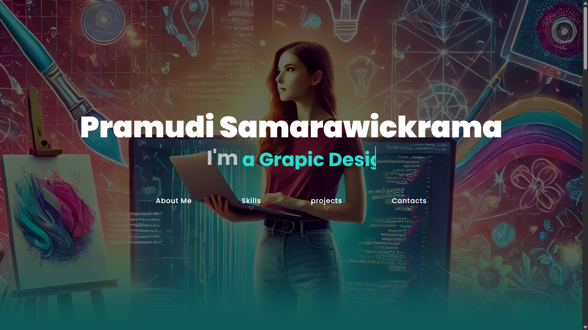
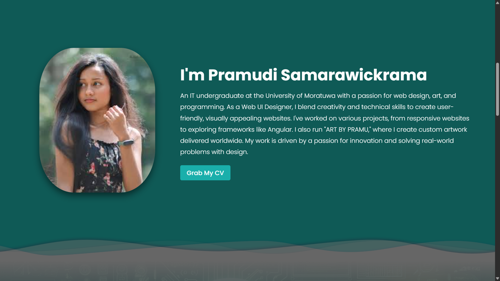
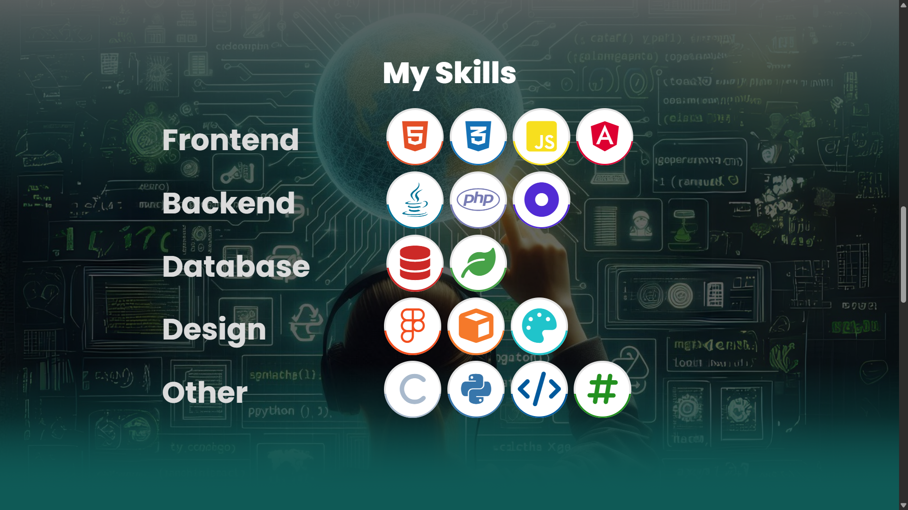
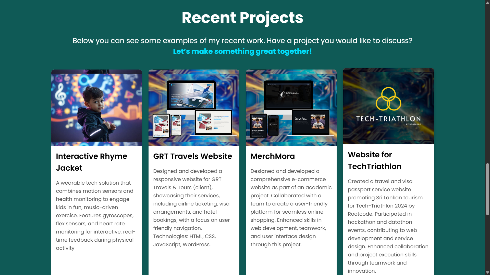
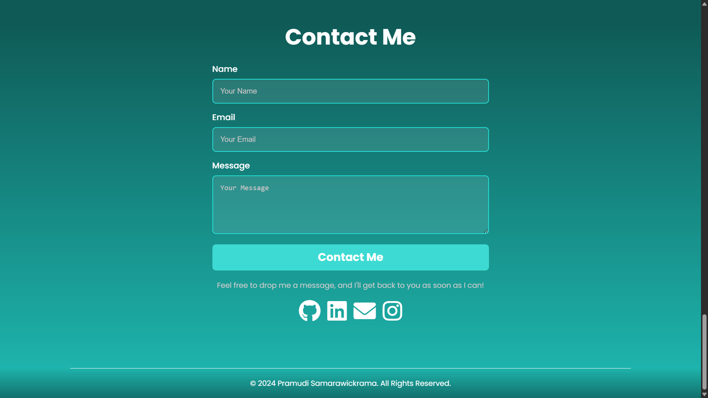

# 🌐 Portfolio Website - Pramudi Samarawickrama

Welcome to the repository for my personal portfolio website!  
This project showcases my skills, experience, and creative work as an **IT undergraduate, Web UI Designer, and Artist**.

> 🚧 **Status:** Currently under development.

## ✨ Features

- My academic and professional journey  
- Projects and technical skills  
- Contact and resume access  

## ⚙️ Technologies Used

- **Frontend:** Angular  
- **Backend:** .NET  
- **Database:** MongoDB  

## 🖼️ Screenshots

### 🔹 Home Page  

### 🔹 About Me Section  

### 🔹 Skills Section  

### 🔹 Projects Section  

### 🔹 Contact Section  

