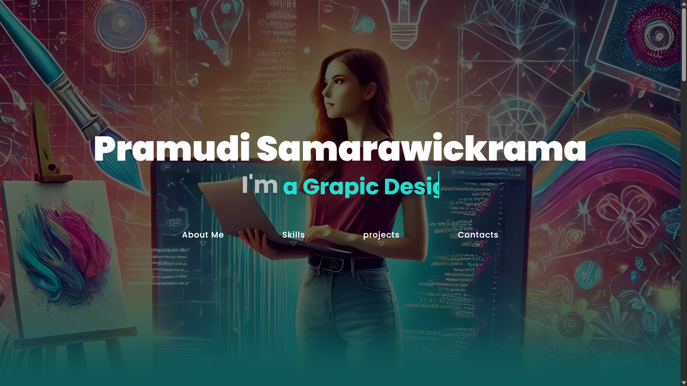
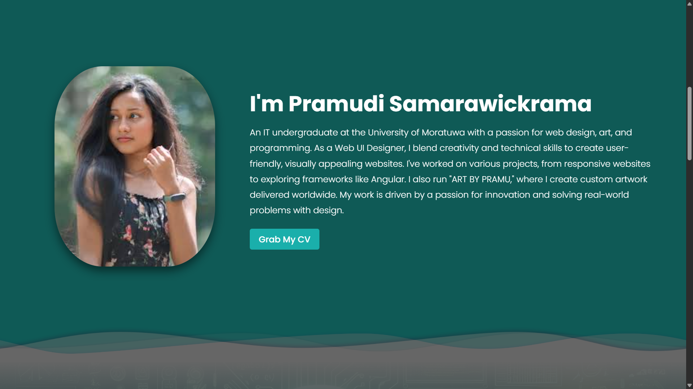
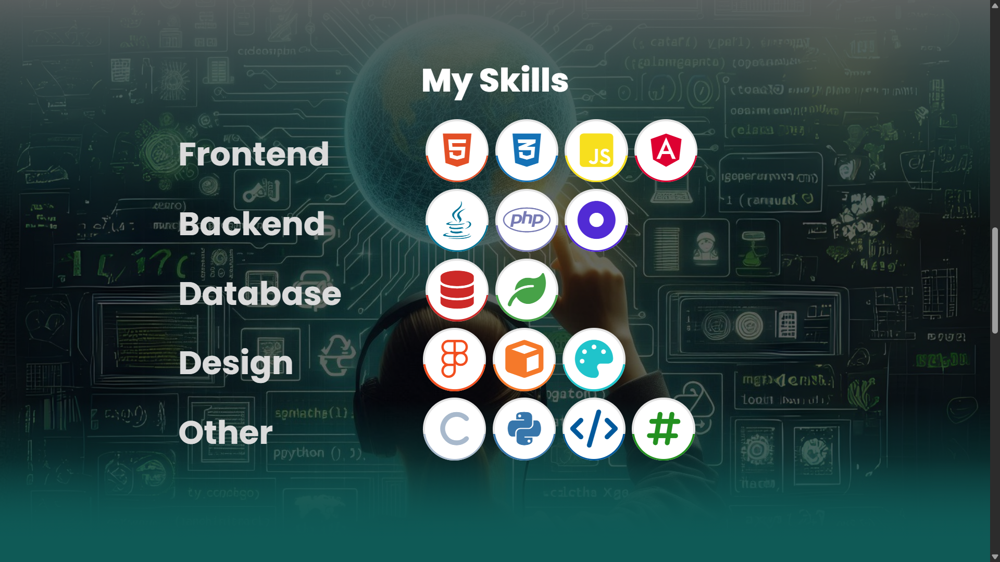
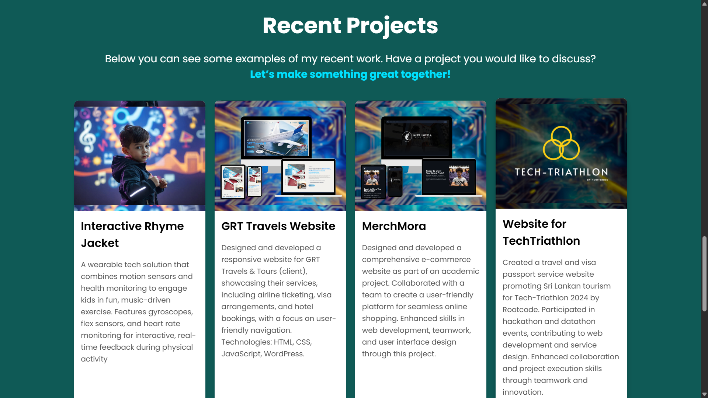
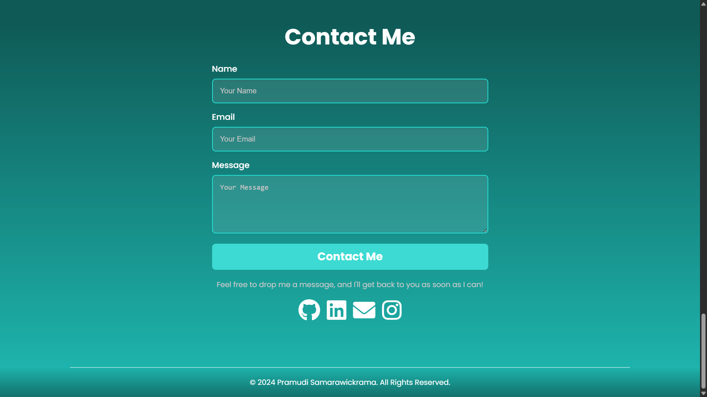

# 🌐 Portfolio Website - Pramudi Samarawickrama

Welcome to the repository for my personal portfolio website!  
This project showcases my skills, experience, and creative work as an **IT undergraduate, Web UI Designer, and Artist**.

Live site: https://portfolio990.web.app

> 🚧 **Status:** Fully developed and deployed

## ⚙️ Technologies Used

- **Frontend:** 
  - Angular (Standalone Components)
  - TypeScript
  - AOS (Animate On Scroll)
  - Reactive Forms
  - Router Module for navigation
- **Backend:** 
  - Node.js/Express (for email services)
  - RESTful API endpoints
- **Email Service:** 
  - Nodemailer with Gmail
  - Custom email templates
- **Styling:**
  - CSS with responsive design
  - Font Awesome icons
  - Custom animations

## 📧 Email System Features

The portfolio includes an integrated contact system with:

- **Secure Form Submission:** Data validation on both client and server side
- **Email Notifications:** Instant delivery of contact messages to portfolio owner
- **Auto-Reply System:** Automatic confirmation emails to users who submit the form
- **Environment Variable Configuration:** Secure credential management
- **Responsive Status Updates:** Clear feedback on submission status
- **Error Handling:** Comprehensive error management and user feedback

## 🛠️ Technical Implementation

- **Frontend Components:**
  - Standalone Angular components for modularity
  - Reactive forms with comprehensive validation
  - Interactive project carousel with touch support
  - Dynamic typing animation component
  - Status indicators (loading, success, error)
  - Responsive design for all device sizes
  - Smooth scroll navigation

- **Backend Services:**
  - RESTful API endpoint for form processing
  - Nodemailer integration with Gmail
  - Error handling and logging
  - Environment variable configuration for security
  - CORS configuration for secure client-server communication
  
  - Backend repository: https://github.com/Pramudi02/Backend

<!--## 🖼️ Screenshots

 ### 🔹 Home Page  


### 🔹 About Me Section  


### 🔹 Skills Section  


### 🔹 Projects Section  


### 🔹 Contact Section  
 -->


## 📥 Setup Instructions

### Step 1: Clone the Repository

```bash
git clone https://github.com/Pramudi02/MyPortfolio
cd MyPortfolio
```

### Step 2: Setup and Run the Frontend

1. Install dependencies:
```bash
npm install
```

2. Start the Angular development server:
```bash
ng serve
```

3. Open your browser and navigate to:
```
http://localhost:4200
```

### Step 3: Setup and Run the Backend

1. Navigate to the backend folder:
```bash
cd backend
```

2. Install dependencies:
```bash
npm install
```

3. Create a `.env` file in the backend directory:
```
EMAIL_USER=your-email@gmail.com
EMAIL_PASS=your-email-password-or-app-password
PORT=3000
```

4. Start the backend server:
```bash
npm start
```

The backend API will be available at `http://localhost:3000`

## 📝 Notes

- For Gmail integration, you'll need to:
  1. Enable 2-Factor Authentication
  2. Generate an App Password
  3. Use the App Password in your `.env` file
- Ensure Node.js and npm are installed on your system
- The frontend will communicate with the backend for form submissions
- Keep your `.env` file secure and never commit it to version control

## 🔧 Troubleshooting

- If `ng serve` fails, try:
  1. Clearing npm cache: `npm cache clean --force`
  2. Deleting node_modules: `rm -rf node_modules`
  3. Reinstalling dependencies: `npm install`
- For email service issues:
  1. Verify Gmail App Password
  2. Check CORS configuration
  3. Ensure backend server is running
- For port conflicts:
  1. Change frontend port: `ng serve --port 4201`
  2. Change backend port in `.env` file

---

For any questions or issues, feel free to reach out or open an issue on GitHub!

*Happy coding! 🚀*

```
